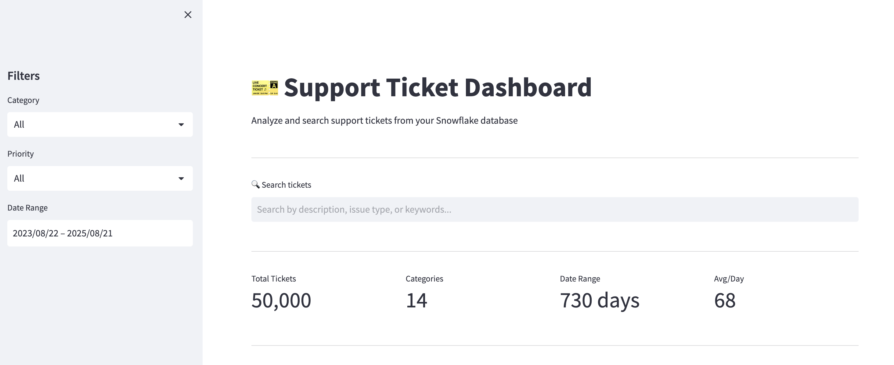

# Support Ticket Dashboard

A Streamlit in Snowflake application for analyzing and searching support tickets.



## Features

- **Interactive Filters**: Filter tickets by category, priority, and date range
- **Visual Analytics**:
  - Time series chart showing ticket trends
  - Bar chart of tickets by category
  - Pie chart of ticket distribution by priority
- **Semantic Search**: Search tickets using Cortex Search for intelligent matching
- **Ticket Browser**: View and explore individual ticket details

## Prerequisites

- Snowflake account with Streamlit enabled
- Access to the following objects:
  - `DASH_MCP_DB.DATA.FACT_SUPPORT_TICKETS` table
  - `DASH_MCP_DB.DATA.SUPPORT_TICKETS_SEARCH` Cortex Search service
- Warehouse for query execution

## Deployment

### Using Snowflake CLI

```bash
snow streamlit deploy SUPPORT_TICKET_DASHBOARD \
  --file app.py \
  --env-file environment.yml \
  --database DASH_MCP_DB \
  --schema DATA \
  --query-warehouse DEMO_WH \
  --connection <your-connection> \
  --replace
```

### Manual Deployment

1. Navigate to Snowsight > Streamlit
2. Create a new Streamlit app in `DASH_MCP_DB.DATA`
3. Upload `app.py` and `environment.yml`
4. Set the warehouse to your preferred warehouse

## Project Structure

```
├── app.py              # Main Streamlit application
├── environment.yml     # Python dependencies for Snowflake
├── requirements.txt    # Python dependencies (local development)
└── snowflake.yml       # Snowflake CLI configuration
```

## Dependencies

- streamlit
- pandas
- plotly
- snowflake-snowpark-python
